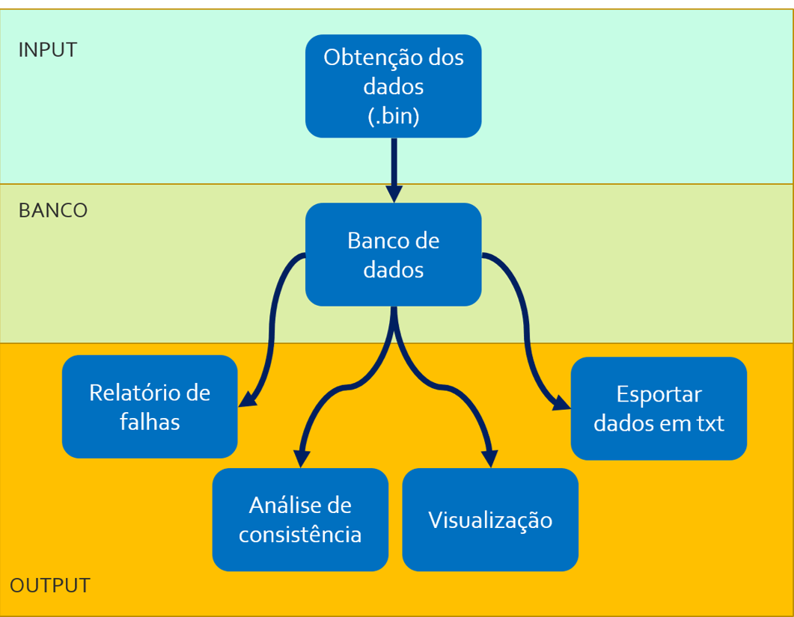

# Processamento e análise de dados de precipitação oriundos de radar

## Justificativa

A modelagem de processos hidrológicos é baseada na interdependência de diversas variáveis chave que compõe o ciclo hidrológico, dentre elas podemos citar a precipitação. Collischonn (2010) define a precipitação como toda a forma de água que atinge a superfície terrestre, como chuva, neblina, orvalho ou geada, sendo a chuva q formas mais comum de precipitação no território brasileiro.

O monitoramento desta variável permite a aplicação desses dados em modelos matemáticos que possibilitam estimar condições climáticas (modelos metereológicos) e vazões (modelos hidrológicos/hidráulicos) em dada região, tornando-se importante fonte de dados para estudos científico, além de auxiliar como ferramenta de gestão de riscos. 
Atualmente diversos órgãos e entidades realizam o monitoramento de dados dessa variável, como Cemaden, Semarh, Ana e radares meteorológicos. Cada uma dessas entidade dão origem à dados de diferentes formatações, padrões e frequências. Contudo, os modelos hidrológicos recebem um formato padrão, e muitas vezes único, o que gera a necessidade de manipulação desses dados antes da sua utilização. Outros problemas enfrentados com esse tipo de dado é a existência de falhas e inconsistências, que devem ser analisadas e tratadas criteriosamente antes do uso dos mesmos, evitando, no processo de modelagem, resultados incoerentes com a realidade.

Partindo desse viés, o projeto proposto almeja a elaboração de uma aplicação que viabilize de forma prática a análise e tratamento de dados de precipitação oriundos de radar, sendo manipulados de forma a prepara-los como entrada em modelos hidrológicos.

## Objetivos

## Resultados esperados

Espera-se o desenvolvimento de uma aplicação executável em windows, que permita a interação do usuário através de uma interface de comandos e seja estruturado conforme a Figura 1. 

Os dados necessários para entrada no programa (input) serão arquivos binários selecionados pelo usuário a partir de caixas de diálogo, já os dados de saída serão arquivos txt, gráficos e informações escritas. 

<table class="image">
<caption align="bottom">Figura 1 - Estruturação das funcionalidades do programa</caption>
<tr><td>
</td></tr>
</table>

## Detalhamento dos produtos

O projeto será dividido em 4 Produtos: o primeiro produto consta de uma versão beta capaz de fazer a leitura dos arquivos binários e conversão em arquivos de texto; o segundo produto constará de uma nova versão beta, onde agregará as funcionalidades de relatório de falhas e análise de consistência, além da correção de erros encontrados na versão anterior; O terceiro produto será uma versão RC, onde incluirá as funcionalidades das versões anteriores, além do módulo de visualização dos dados; E o quarto produtor será a versão final, onde será feita a correção de erros e outros ajustes necessário para o uso pelo cliente.

#### Produto 1: Leitura de arquivos binários e conversão para txt.

Como entrada o usuário podera inserir, através de uma janela de diálogo, os arquivos .bin que contenha os dados de precipitação no formato fornecido pelos radares metereológicoo. A saída serão arquivos .txt no formato padrão de entrada do modelo hidrológico MGB-IPH.

#### Produto 2: Relatório de falhas e análise de consistência.

Agregará as funcionalidades do Produto 1, além de que o usuário poderá escolher se o programa fará relatório de falhas e/ou preenchimento delas a partir de interpolação. Além disso, será possível escolher se será realizada a análise de consistência dos dados utilizando o método da dupla-massa e o que acontecerá com os dados inconsistentes (retirada ou substituição por preenchimento de falhas).

#### Produto 3: Visualização.

Complementando o Produto 2, será adicionado um módulo de vizualização de dados, onde será possível a visualização temporal e espacial das séries, através da plotagem de gráficos interativos (hidrogramas e mapas de precipitação).

#### Produto 4: Versão Final.

Nesta versão serão corrigidos erros e realizados ajustes na versão anterior.

## Metodologia de execução

O planejamento e gerenciamento das atividades do projeto ocorrerá utilizando versionamento de código ([github](http://github.com/ewerton94/rain_consistency)), kanban ([waffle](https://waffle.io/ewerton94/rain_consistency)) e comunicação formal por slack. O código fonte do programa poderá ser encontrado no github.

## Premissas e restrições do projeto

1. O time de densolvimento tem certa proximidade com o cliente, por isso espera-se que dúvidas levantadas sejam sanadas em até 3 dias. 

2. Para que as atividades possam ser realizadas no prazo, cada membro dedicará ao menos 4 horas semanais ao desenvolvimento da etapa de projeto.

## Cronograma

|Prazos     | Atividades         
| :------------- |:-------------:|
| 19/03/2018     |Estrutura do projeto em Jupyter Notebook |
| 28/03/2018    |Estrutura do código e divisão das tarefas |  
| 02/04/2018 |Entrega do Produto 1: Aplicativo capaz de fazer leitura dos dados em .bin e preparação para lançamento no modelo|
| 09/04/2018      | Entrega do Produto 2: versão do aplicativo com módulo de processamento e análise dos dados |
| 18/04/2018 | Entrega do Produto 3: versão do aplicativo com módulo de visualização dos dados |
| 23/04/2018 | Entrega do Produto 4: versão final do aplicativo |
